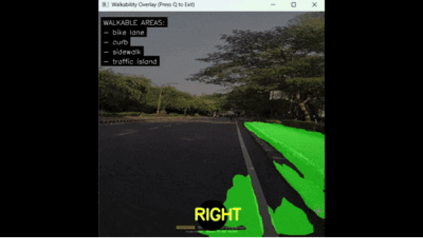
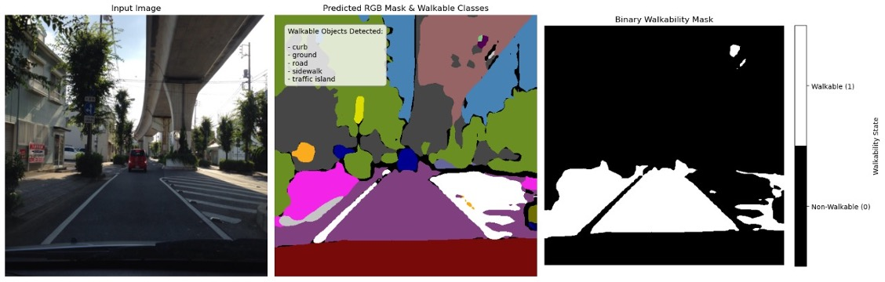
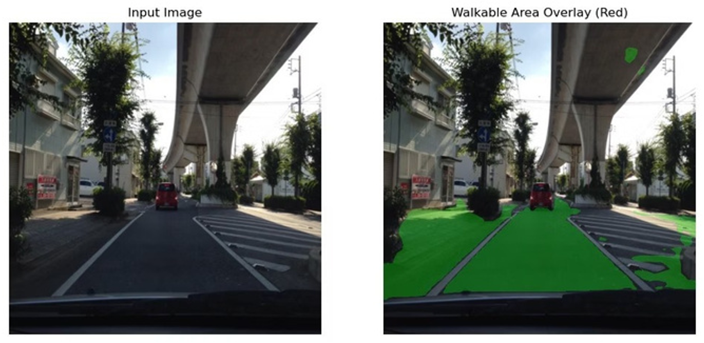

# Walkable Path Detection and Audio Navigation System

A real-time computer vision system designed to help visually impaired users navigate outdoor environments. The system uses semantic segmentation to identify walkable areas, determines a suitable direction to move, and provides real-time audio instructions.

## Working Pipeline

The system follows a pipeline of **data preprocessing → model training → segmentation → walkability mapping → navigation → audio guidance**.

## Data Preprocessing

The project uses the **Mapillary Vistas** dataset, which contains street-level images with detailed annotations. Each image has a corresponding JSON file containing polygon annotations for the objects and surfaces present in the scene.

These polygon annotations are converted into pixel-wise segmentation masks. The original dataset class IDs are then mapped to compact class IDs so that each pixel has a consistent label that can be used by the segmentation model.

The processed images and masks are loaded as image-mask pairs through a custom PyTorch dataset.

## Model & Training

We use **DeepLabv3 with a ResNet-50 backbone** for semantic segmentation. The model learns to classify every pixel in an image according to its semantic class.

The model is trained using **PyTorch**, with **Cross Entropy Loss** and the **Adam optimizer**. After training, the model takes a new street image and produces a semantic segmentation mask representing the different surfaces and objects in the scene.

## Mask Processing & Walkability

Semantic segmentation tells us what each part of the scene is, but it does not directly tell us whether that region is suitable for walking.

To solve this, each semantic class is assigned a walkability score. For example, sidewalks are considered highly walkable, roads are given a lower score, while objects such as vehicles, walls, and poles are treated as non-walkable.

The resulting scores are converted into a binary walkability mask, separating walkable areas from non-walkable areas. This mask is used to generate the visual overlay and is also passed to the navigation system.

The walkability mapping is independent of the trained segmentation model, meaning that the definition of which classes are considered walkable can be changed without retraining the model.

## Navigation

The system determines the direction of movement from the detected walkable region.

Areas near the bottom of the frame are given more importance because they are closer to the user. The system then calculates the centre of the weighted walkable region and compares it with the centre of the camera view.

If the walkable region is towards the left or right, the system gives a corresponding direction. If it is centred, the system indicates **FORWARD**.

A separate safety check examines the area directly in front of the user. If this region is not walkable, the system looks for an alternative path to the left or right. If no suitable path is available, it outputs **STOP**.

## Audio Cues

The selected navigation direction is converted into speech using the offline `pyttsx3` text-to-speech engine.

The system provides four basic instructions:

**LEFT · RIGHT · FORWARD · STOP**

Audio output is rate-limited so that the same instruction is not repeatedly spoken while the user is moving.
